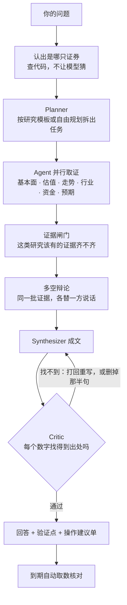

<div align="center">


# WealthPilot

> *「看到有人说好就买了，过后连当初为什么买都说不清。」*

**你自己的投研 Agent：每个数字有出处 · 判断写成能核对的话 · 到期回头看对不对**

<sub>本地运行 · 自带 Key · A 股为主，港股美股可查可记 · 不下单，不给目标价</sub>

<br>

[](https://jackychen-12.github.io/wealthpilot/)

[](https://github.com/Jackychen-12/wealthpilot/actions/workflows/test.yml)
[](https://github.com/Jackychen-12/wealthpilot/actions/workflows/deploy.yml)
[](https://github.com/Jackychen-12/wealthpilot/stargazers)
[](LICENSE)


<br>

**不是又一个行情软件，也不是让大模型替你写一篇分析。**

行情、K 线、下单，同花顺和东方财富已经做得很好了。<br>
它们不管的是另一段：这只股票到底研究清楚没有，当初凭什么买的，后来证明是对是错。

问一句“帮我分析一下宁德时代”，六个 Agent 分头取数，看多看空先辩一轮，再成文。<br>
回答里的每个数字都要在数据里找得到出处，找不到的不让发布。<br>
最关键的几条判断记成“验证点”，到期由程序取数核对，成立还是被证伪都记下来。

[在线演示](https://jackychen-12.github.io/wealthpilot/) · [能做什么](#能做什么) · [架构](#架构) · [快速开始](#快速开始) · [Roadmap](#roadmap) · [完整说明](docs/reference.md)

</div>

---

## 能做什么

网页、终端、手机里都是同样五件事：

|  | 回答什么问题 | 里面有什么 |
|:---:|---|---|
| 🏠 **今日** | 我的股票现在怎么样，有什么等我处理 | 持仓和自选一张表：涨跌、持有收益、估值分位、当初的判断还成立几条；今天它们出了什么事 |
| 🔎 **研究** | 这只股票怎么样 | 深度研究、个股对比、快速回答；每次的回答和证据都留着，可以导出 |
| 📈 **市场** | 今天市场本身怎么样 | 大盘复盘（涨停、题材、情绪）、宏观数据、选股器 |
| 💼 **持仓** | 我手上有什么，风险在哪 | A 股、港股、美股、基金放在一本人民币的账里；自选；风险体检 |
| 🧾 **回顾** | 我之前判断得对不对 | 验证点成绩单、立场回溯、买入理由按来源对账、交易行为诊断 |

给有一定投资经验、但还没有自己一套体系的人用。以 A 股为主，港股和美股能查、能研究、能记进持仓。

---

## 为什么不一样

| 常见的做法 | 这里的做法 |
|---|---|
| 模型写完就发，数字对不对看运气 | **数字有出处才能发布**：每个数字都要在工具返回的数据里找得到，找不到就打回重写，再不行把那半句删掉 |
| 只管说，不管后来对不对 | **说过的话到期核对**：判断记成验证点，到期由程序取数核对，成立还是被证伪都记，不挑好看的说 |
| 让模型自己算占比、算分位 | **算术不交给模型**：占比、分位、回撤、仓位上限都由代码算 |
| 直接给目标价、给买卖点 | **不出目标价**：估值只说“现价隐含了多高的增长”；操作建议要你逐条授权，它自己没有下单的能力 |
| 数据取不到就悄悄编一个，或者悄悄没有 | **取不到就直说**：关键数据各有备用来源，都不通时用上一次取到的并写明日期；哪一路断了看得见 |

---

## 架构

一次研究是这样走的：



| 选型 | 理由 |
|---|---|
| **Agent 按研究维度分**，不按资产分 | 基本面、估值、走势、行业、资金、预期互不依赖，天然可以并行；各自工具少，模型不容易选错。另有选股、组合、基金、复盘四个，共用 59 个工具 |
| **固定的研究走模板** | 个股深度研究、对比、持仓诊断怎么拆任务由代码定，质量稳定；只有自由提问才让模型自己规划 |
| **回答的校验用确定性规则**，不靠另一个模型打分 | 数字溯源、章节完整、财务数字带报告期、禁止预测，都是写在代码里的规则，同一份回答每次结论一样 |
| **一个进程，本地 SQLite** | FastAPI 同时提供接口、网页和每日盯盘；终端和手机渠道走同一套流程。数据在你自己的电脑上 |
| **模型不绑定** | Claude，或任何兼容 OpenAI 接口的服务（DeepSeek、通义、Kimi、本机 Ollama……）；主模型用不了时自动换备用的 |
| **数据把“会断”当常态** | 来源是公开的行情和财务接口，没有服务保障。关键数据各排一个备用来源，LPR、社融、汇率用官方渠道，每天自查一遍 |
| **MCP 双向** | 自己是一个 MCP Server（59 个工具给 Claude Code、Cursor 用）；也能把外部的 MCP 数据服务接进来，只读 |

技术栈：Python 3.11+ · FastAPI · SQLModel · SQLite｜React 19 · Vite · Tailwind 4｜Anthropic SDK 与 OpenAI 兼容接口。

---

## 快速开始

**安装**（macOS / Linux，机器上有 git 和 curl 就行）

```bash
curl -fsSL https://raw.githubusercontent.com/Jackychen-12/wealthpilot/main/scripts/install.sh | bash
```

Windows 用 PowerShell。这个脚本还没有在 Windows 上实际跑过，装不上请发 issue，或者在 WSL 里用上面那条：

```powershell
irm https://raw.githubusercontent.com/Jackychen-12/wealthpilot/main/scripts/install.ps1 | iex
```

**配置和启动**

```bash
wealthpilot setup
```

```bash
wealthpilot
```

1. `setup` 带你选一家模型、贴一个 Key、放进你的股票，一分钟
2. `wealthpilot` 启动后，当前窗口是终端，网页版同时在 <http://localhost:8000>，每日盯盘跟着这个进程跑
3. 不配 Key 也能用行情、复盘、选股、持仓和风险体检这些不调用模型的部分，只是不能让它研究

**在终端里**：直接打字就是提问。下面这些词直接打，不调用模型：

```
今日              你的股票今天有什么事
/stock 茅台       一只股票的行情、估值、财务
大盘  复盘  宏观   指数与行业 · 涨停与题材 · PMI 和利率
持仓  自选        现价和盈亏；录入：/add 茅台 100 1500
回顾              之前的判断对不对
对账              按消息来源看买入之后的结果
```

`/quick 问题` 十来秒给个简短的，`/deep 问题` 做完整研究，`/help all` 看全部命令。

**其他入口**

| 入口 | 怎么用 |
|---|---|
| 网页 | <http://localhost:8000>，左边栏就是上面那五件事 |
| 手机 | `wealthpilot channels` 接 Telegram、飞书、钉钉或企业微信，收每日简报、直接提问 |
| Claude Code / Cursor | 在 `.mcp.json` 里加下面这一段，就能调用它的 59 个工具 |

```json
{ "mcpServers": { "wealthpilot": { "command": "uv", "args": ["run", "--directory", "/path/to/wealthpilot/backend", "python", "-m", "wealthpilot", "mcp"] } } }
```

**常用命令**：`wealthpilot status` 看现在的状态 · `doctor` 查哪里不通 · `update` 升级 · `backup` / `restore` 备份恢复 · `help` 全部命令。

**从源码运行**

```bash
git clone https://github.com/Jackychen-12/wealthpilot.git && cd wealthpilot
make setup && make install
wealthpilot setup
```

`make dev` 是开发模式，`make test` 跑测试。Docker：`cp backend/.env.example backend/.env`，填上 Key，再 `docker compose up --build -d`。

---

## Roadmap

已经有的：

- [x] **多 Agent 研究流程**：证券解析、按维度分工的 Agent、研究模板、证据链、多空辩论、Critic 校验
- [x] **事后验证**：验证点到期核对、立场回溯、买入理由按来源对账、交易行为诊断
- [x] **三个入口**：网页工作台、终端、手机渠道（Telegram / 飞书 / 钉钉 / 企业微信），外加 MCP Server
- [x] **能长期用的基础**：一条命令安装、任意 OpenAI 兼容模型与备用模型、用量与预算、每日盯盘、备份恢复、日志与自检
- [x] **市场与估值**：大盘复盘、宏观、选股与条件回测、反向 DCF、点名对比
- [x] **港股和美股**：行情、财务、估值分位、对应的研究计划、按人民币记进持仓
- [x] **数据的地基**：主备来源自动切换、认出对方改版、取不到时用上一次的并写明日期、状态表与每日自查
- [x] **做减法**：所有入口收成今日 / 研究 / 市场 / 持仓 / 回顾五件事

接下来：

- [ ] 用真实模型做一次完整回归；评测集从 12 题扩到 20 题以上，多次取平均
- [ ] 从同花顺、东方财富导入自选和持仓
- [ ] Tushare 这类授权数据做成内置来源，加一个“只用官方和授权来源”的开关
- [ ] 港股通持股变化、美股机构持仓与内部人买卖（都有官方数据）
- [ ] 手机渠道、Windows 安装、外部数据服务在真实环境里实测
- [ ] 个股页、设置页内部继续做减法

每一版改了什么见 [更新记录](CHANGELOG.md)。

---

## 要知道的几件事

- **不构成投资建议。** 它给的是带出处的研究和可核对的判断，买卖由你自己决定。
- **数据没有服务保障。** 都是公开接口，对方改版或限流就会断。备用来源和每天的自查只是让断线不那么疼，不是把数据变可靠。
- **验证还不充分。** 真实模型上的评测只有 12 题、每版跑一次（2026-10-04）；之后加的功能只做过不调用模型的测试。
- **合盖就停。** 电脑休眠时进程会挂起，盯盘和进行中的研究都会停；醒来后会把错过的那次盯盘补上。

每项功能的细节、全部命令和接口、配置项、数据来源表，都在 [完整说明](docs/reference.md) 里。

---

## 致谢

- **[ZhuLinsen/daily_stock_analysis](https://github.com/ZhuLinsen/daily_stock_analysis)** — 工作台的工程脚手架与外壳结构起步于它的 Web 端（MIT，许可见 `workbench/THIRD_PARTY_LICENSE.dsa-web`）
- **[VoltAgent/awesome-design-md](https://github.com/VoltAgent/awesome-design-md)** — 视觉规范参考了其中的 Notion 设计分析
- **[OpenClaw](https://github.com/openclaw/openclaw) 与 [Hermes Agent](https://github.com/NousResearch/hermes-agent)** — 一条命令安装、贴一个 Key 就能用、什么事都有命令，这些“Agent 该有的基础体验”是对着它们做的
- **[TradingAgents](https://github.com/TauricResearch/TradingAgents)、[ai-hedge-fund](https://github.com/virattt/ai-hedge-fund)、[FinRobot](https://github.com/AI4Finance-Foundation/FinRobot)**，以及 Vibe-Trading、ai-berkshire 等二十来个投研项目 — 每日大盘复盘、不开电脑的日报、立场成绩单、反向 DCF、交易行为诊断，是调研它们之后补上的
- **[DeepSeek Harness](https://github.com/deepseek-ai/deepseek-harness)** — 研究方法（技能）的文件格式和它兼容
- **数据** — 腾讯财经、东方财富、新浪财经、百度股市通、同花顺的公开数据；巨潮资讯、中国人民银行、中国货币网、沪深交易所的官方披露

欢迎 PR 和 Issue。

---

## 作者

**Jacky Chen** · AI Product Manager who ships

[](https://github.com/Jackychen-12)

> 既定义 AI 产品，也亲手把它搭出来。

---

## License

[MIT](LICENSE)
