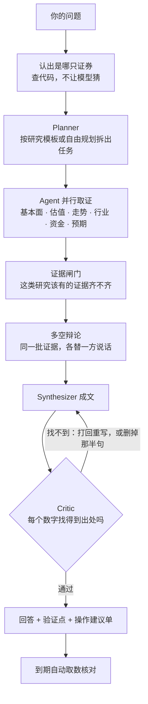

<p align="center">
  
</p>

<h1 align="center">WealthPilot</h1>

<p align="center">
  <strong>你自己的投研 Agent：把一只股票研究清楚，把判断写成能核对的话，到期回头看对不对</strong>
</p>

<p align="center">
  <a href="https://jackychen-12.github.io/wealthpilot/">在线演示</a> &nbsp;|&nbsp;
  <a href="#核心功能">核心功能</a> &nbsp;|&nbsp;
  <a href="#架构">架构</a> &nbsp;|&nbsp;
  <a href="#用法">用法</a> &nbsp;|&nbsp;
  <a href="docs/reference.md">完整说明</a>
</p>

---

给有一定投资经验、但还没有自己一套体系的人用。行情软件你已经有了，这里不重复它，做的是它不做的那一段：

- **研究**：问一句“帮我分析一下宁德时代”，几个 Agent 分头取数，每个数字都带出处，对不上的不让发布。
- **留下判断**：每次研究最关键的几条结论，记成到期能用数据核对的“验证点”。
- **回头看**：到期自动核对；你自己的买卖也能对账——听谁的买的，后来怎么样。

以 A 股为主，港股和美股能查、能研究、能记进持仓。本地运行，数据在你自己的电脑上；模型用你自己的 Key（Claude、DeepSeek，或任何兼容 OpenAI 接口的服务）。它不下单，不给目标价。

## 核心功能

网页、终端、手机里都是同样五件事：

| | 回答什么问题 | 里面有什么 |
|---|---|---|
| **今日** | 我的股票现在怎么样，有什么等我处理 | 持仓和自选一张表：涨跌、持有收益、估值分位、当初的判断还成立几条；今天它们出了什么事 |
| **研究** | 这只股票怎么样 | 深度研究、个股对比、快速回答；每次的回答和证据都留着，可以导出 |
| **市场** | 今天市场本身怎么样 | 大盘复盘（涨停、题材、情绪）、宏观数据、选股器 |
| **持仓** | 我手上有什么，风险在哪 | 持仓（A 股、港股、美股、基金，按人民币记账）、自选、风险体检 |
| **回顾** | 我之前判断得对不对 | 验证点成绩单、立场回溯、买入理由按来源对账、交易行为诊断 |

和“让大模型写一篇分析”不一样的三点：

1. **数字有出处才能发布。** 回答里的每个数字都要能在工具返回的数据里找到，找不到就打回重写，再不行把那半句删掉。
2. **说过的话事后会被核对。** 判断到期后由程序取数核对，成立还是被证伪都记下来，不挑好看的说。
3. **算术和边界不交给模型。** 占比、分位、回撤由代码算；不出目标价；操作建议要你逐条授权，它自己没有下单的能力。

## 架构

一次研究是这样走的：



- **Agent 按研究维度分工**，不按资产分：基本面、估值、走势、行业、资金与筹码、预期与消息各一个，另有选股、组合、基金、复盘。它们共用 59 个工具，每次工具返回记成一条带编号的证据。
- **固定的研究走固定的流程**：个股深度研究、对比、持仓诊断这些有模板，任务怎么拆由代码定；只有自由提问才让模型自己规划。
- **一个进程**：FastAPI 后端同时提供接口、网页和每日盯盘；终端和手机渠道（Telegram、飞书、钉钉、企业微信）走同一套研究流程；数据存在本地 SQLite。
- **数据**来自公开的行情和财务接口（腾讯、东方财富、新浪、百度），LPR、社融、汇率用的是官方渠道，公告和两融有官方的备用。关键数据各有一个备用来源，都取不到时用上一次取到的并写明日期；哪一路不通在「设置 → 数据连接」里看得见。
- **对外**：自己是一个 MCP Server（59 个工具给 Claude Code、Cursor 用）；也能把外部的 MCP 数据服务接进来，只读。

技术栈：Python 3.11+ · FastAPI · SQLModel · SQLite｜React 19 · Vite · Tailwind 4｜Anthropic SDK 与 OpenAI 兼容接口。

## 用法

### 安装

macOS / Linux，机器上有 git 和 curl 就行：

```bash
curl -fsSL https://raw.githubusercontent.com/Jackychen-12/wealthpilot/main/scripts/install.sh | bash
```

Windows（PowerShell）。这个脚本还没有在 Windows 上实际跑过，装不上请发 issue，或者在 WSL 里用上面那条：

```powershell
irm https://raw.githubusercontent.com/Jackychen-12/wealthpilot/main/scripts/install.ps1 | iex
```

代码装在 `~/.wealthpilot/app`，你的数据（配置、数据库、研究方法）在 `~/.wealthpilot`，升级和重装都不动它。

### 配置和启动

```bash
wealthpilot setup
```

```bash
wealthpilot
```

`setup` 带你选一家模型、贴一个 Key、放进你的股票，一分钟。`wealthpilot` 启动后，当前窗口是终端，网页版同时在 <http://localhost:8000>，每日盯盘跟着这个进程跑。

不配 Key 也能用行情、复盘、选股、持仓和风险体检这些不调用模型的部分，只是不能让它研究。

### 在终端里

直接打字就是提问。下面这些词直接打，不调用模型：

```
今日              你的股票今天有什么事
/stock 茅台       一只股票的行情、估值、财务
大盘  复盘  宏观   指数与行业 · 涨停与题材 · PMI 和利率
持仓  自选        现价和盈亏；录入：/add 茅台 100 1500
回顾              之前的判断对不对
对账              按消息来源看买入之后的结果
```

研究时可以指定深浅：`/quick 问题` 十来秒给个简短的，`/deep 问题` 做完整研究。`/help all` 看全部命令。

### 其他入口

- **网页**：<http://localhost:8000>，左边栏就是上面那五件事。
- **手机**：`wealthpilot channels` 接 Telegram、飞书、钉钉或企业微信，收每日简报、直接提问。
- **Claude Code / Cursor**：在 `.mcp.json` 里加一段，就能调用它的 59 个工具。

```json
{ "mcpServers": { "wealthpilot": { "command": "uv", "args": ["run", "--directory", "/path/to/wealthpilot/backend", "python", "-m", "wealthpilot", "mcp"] } } }
```

### 常用命令

| 命令 | 做什么 |
|---|---|
| `wealthpilot status` | 现在的状态：模型、持仓、盯盘、手机、今天的用量 |
| `wealthpilot doctor` | 哪里不通、怎么修（模型、数据源、数据库、手机渠道） |
| `wealthpilot update` | 升级，先备份数据库 |
| `wealthpilot backup` / `restore` | 备份与恢复，换电脑时用 |
| `wealthpilot help` | 全部命令 |

### 从源码运行

```bash
git clone https://github.com/Jackychen-12/wealthpilot.git && cd wealthpilot
make setup && make install
wealthpilot setup
```

`make dev` 是开发模式（后端热重载），`make test` 跑测试。Docker：`cp backend/.env.example backend/.env`，填上 Key，再 `docker compose up --build -d`。

## 要知道的几件事

- **不构成投资建议。** 它给的是带出处的研究和可核对的判断，买卖由你自己决定。
- **数据没有服务保障。** 都是公开接口，对方改版或限流就会断。已经做了备用来源和每天的自查，但这只是让断线不那么疼，不是把数据变可靠。
- **验证还不充分。** 真实模型上的评测只有 12 题、每版跑一次（2026-10-04）；之后加的功能只做过不调用模型的测试。Windows 安装脚本、妙想等外部数据服务都没有实际跑通过。
- **合盖就停。** 电脑休眠时进程会挂起，盯盘和进行中的研究都会停；醒来后会把错过的那次盯盘补上。

## 文档

- [完整说明](docs/reference.md)：每项功能的细节、全部命令和接口、配置项、数据来源表
- [更新记录](CHANGELOG.md)
- [股票能力的规划](docs/stock-roadmap.md)

## License

[MIT](LICENSE)
