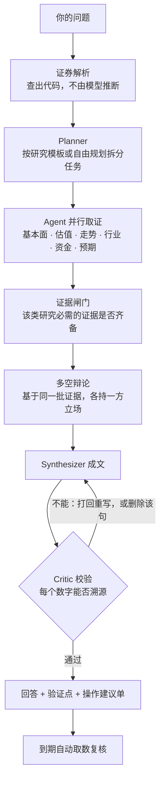

<div align="center">


# WealthPilot

> *「听人说好就买了，回头连当初为什么买都讲不清。」*

**个人投研 Agent：数字可溯源 · 判断可验证 · 到期自动复核**

<sub>本地运行 · 自带模型 Key · A 股为主，覆盖港股美股 · 不下单，不给目标价</sub>

<br>

[](https://jackychen-12.github.io/wealthpilot/)

[](https://github.com/Jackychen-12/wealthpilot/actions/workflows/test.yml)
[](https://github.com/Jackychen-12/wealthpilot/actions/workflows/deploy.yml)
[](https://github.com/Jackychen-12/wealthpilot/stargazers)
[](LICENSE)


<br>

**不是又一个行情软件，也不是让大模型代写一篇分析。**

看盘和下单，同花顺、东方财富已经够用。<br>
它们不管的是另一段：这只股票研究清楚了没有，当初凭什么买，事后证明是对是错。

问一句“帮我分析一下宁德时代”，六个 Agent 并行取证，多空先辩一轮，再成文。<br>
报告里的每个数字都能追溯到取数结果，追溯不到的不发布。<br>
关键判断记为“验证点”，到期由程序取数复核，成立或证伪都如实留档。

[在线演示](https://jackychen-12.github.io/wealthpilot/) · [能做什么](#能做什么) · [架构](#架构) · [快速开始](#快速开始) · [Roadmap](#roadmap)

</div>

---

## 能做什么

网页、终端、手机三个入口，都是同样五件事：

|  | 回答的问题 | 内容 |
|:---:|---|---|
| 🏠 **今日** | 我的股票怎么样，有什么要处理 | 持仓与自选一张表：涨跌、持有收益、估值分位、此前判断的验证状态；当日的财报、公告与异动 |
| 🔎 **研究** | 这只股票怎么样 | 个股深度研究、多股对比、快速问答；每次的结论与证据留档，可导出 |
| 📈 **市场** | 今天市场怎么样 | 大盘复盘（涨停、题材、情绪）、宏观数据、选股器 |
| 💼 **持仓** | 我持有什么，风险在哪 | A 股、港股、美股、基金统一按人民币记账；自选股；风险体检（回撤、集中度、相关性） |
| 🧾 **回顾** | 我之前判断得对不对 | 验证点成绩单、立场回溯、买入理由按来源对账、交易行为诊断 |

面向有一定投资经验、但尚未形成自己投资体系的个人投资者。以 A 股为主，港股和美股支持行情、研究与持仓记账。

---

## 为什么不一样

| 常见做法 | WealthPilot |
|---|---|
| 模型生成即发布，数字无从核对 | **数字溯源**：每个数字都要能在取数结果里找到，否则打回重写；仍对不上的句子删除后再发布 |
| 给出结论就结束，不管后来对不对 | **事后复核**：关键判断记为验证点，到期由程序取数核对，成立与证伪都计入成绩单 |
| 占比、分位交给模型心算 | **计算交给代码**：占比、分位、回撤、仓位上限均由确定性代码计算 |
| 直接给目标价和买卖点 | **不出目标价**：估值只回答“现价隐含了多高的增长”；操作建议须逐条授权，系统本身没有下单能力 |
| 数据缺失时编造，或静默留空 | **缺数明示**：关键数据配有备用来源；全部不可用时沿用上次结果并标注日期；各来源的状态可查 |

---

## 架构

一次研究的流程：



| 选型 | 理由 |
|---|---|
| **按研究维度划分 Agent**，而非按资产类别 | 基本面、估值、走势、行业、资金、预期六个维度互不依赖，可并行取证；每个 Agent 的工具集小，不易选错。另有选股、组合、基金、复盘四个 Agent，共用 59 个工具 |
| **常见研究走固定模板** | 个股深度研究、对比、持仓诊断的任务拆分由代码决定，结果稳定；只有自由提问才交给模型规划 |
| **校验用确定性规则**，而非另一个模型打分 | 数字溯源、章节完整、财务数字带报告期、禁止预测性措辞，均为代码规则，同一份回答每次结论一致 |
| **单进程 + 本地 SQLite** | FastAPI 同时提供接口、网页与每日盯盘；终端和手机渠道复用同一套研究流程；数据留在本机 |
| **模型可替换** | Claude，或任何兼容 OpenAI 接口的服务（DeepSeek、通义、Kimi、本机 Ollama 等）；主模型不可用时自动切换备用模型 |
| **数据按“会中断”设计** | 来源为公开的行情与财务接口，无服务保障。关键数据配有备用来源，LPR、社融、汇率取自官方渠道，每日自检 |
| **MCP 双向** | 自身是 MCP Server（59 个工具供 Claude Code、Cursor 调用）；也可接入外部 MCP 数据服务，只读 |

技术栈：Python 3.11+ · FastAPI · SQLModel · SQLite｜React 19 · Vite · Tailwind 4｜Anthropic SDK 与 OpenAI 兼容接口。

---

## 快速开始

**安装**（macOS / Linux，需要 git 和 curl）

```bash
curl -fsSL https://raw.githubusercontent.com/Jackychen-12/wealthpilot/main/scripts/install.sh | bash
```

Windows 使用 PowerShell。该脚本尚未在 Windows 上实测；如安装失败请提 issue，或在 WSL 中使用上面的命令：

```powershell
irm https://raw.githubusercontent.com/Jackychen-12/wealthpilot/main/scripts/install.ps1 | iex
```

**配置与启动**

```bash
wealthpilot setup
```

```bash
wealthpilot
```

1. `setup` 引导你选择模型服务、填入 Key、录入持仓，约一分钟
2. `wealthpilot` 启动后，当前窗口即终端，网页版同时运行在 <http://localhost:8000>，每日盯盘随进程运行
3. 不配置 Key 也可使用行情、复盘、选股、持仓与风险体检等不调用模型的功能

**终端**：直接输入问题即发起研究。以下指令不调用模型：

```
今日              持仓与自选当日的动态
/stock 茅台       个股的行情、估值、财务
大盘  复盘  宏观   指数与行业 · 涨停与题材 · PMI 与利率
持仓  自选        现价与盈亏；录入：/add 茅台 100 1500
回顾              此前判断的验证结果
对账              按消息来源统计买入后的表现
```

`/quick 问题` 约十秒给出简要回答，`/deep 问题` 做完整研究，`/help all` 查看全部命令。

**其他入口**

| 入口 | 用法 |
|---|---|
| 网页 | <http://localhost:8000>，侧栏即上面五项；接口文档在 `/docs` |
| 手机 | `wealthpilot channels` 接入 Telegram、飞书、钉钉或企业微信，接收每日简报、直接提问 |
| Claude Code / Cursor | 在 `.mcp.json` 中加入下面的配置，即可调用全部 59 个工具 |

```json
{ "mcpServers": { "wealthpilot": { "command": "uv", "args": ["run", "--directory", "/path/to/wealthpilot/backend", "python", "-m", "wealthpilot", "mcp"] } } }
```

**常用命令**：`wealthpilot status` 查看当前状态 · `doctor` 自检 · `update` 升级 · `backup` / `restore` 备份与恢复 · `help` 全部命令。配置项见 `backend/.env.example`。

**从源码运行**

```bash
git clone https://github.com/Jackychen-12/wealthpilot.git && cd wealthpilot
make setup && make install
wealthpilot setup
```

`make dev` 为开发模式，`make test` 运行测试。Docker：`cp backend/.env.example backend/.env` 并填入 Key，然后 `docker compose up --build -d`。

---

## Roadmap

已完成：

- [x] **多 Agent 研究流程**：证券解析、按维度分工的 Agent、研究模板、证据链、多空辩论、Critic 校验
- [x] **事后验证**：验证点到期复核、立场回溯、买入理由按来源对账、交易行为诊断
- [x] **三个入口**：网页工作台、终端、手机渠道（Telegram / 飞书 / 钉钉 / 企业微信），以及 MCP Server
- [x] **长期使用的基础能力**：一键安装、任意 OpenAI 兼容模型与备用模型、用量与预算、每日盯盘、备份恢复、日志与自检
- [x] **市场与估值**：大盘复盘、宏观数据、选股与条件回测、反向 DCF、点名对比
- [x] **港股与美股**：行情、财务、估值分位、对应的研究计划、按人民币记入持仓
- [x] **数据可靠性**：主备来源自动切换、识别对方接口改版、不可用时沿用上次结果并标注日期、状态表与每日自检
- [x] **产品收敛**：全部入口统一为今日 / 研究 / 市场 / 持仓 / 回顾五项

计划中：

- [ ] 用真实模型做一次完整回归；评测集由 12 题扩充到 20 题以上，多次运行取平均
- [ ] 从同花顺、东方财富导入自选与持仓
- [ ] 将 Tushare 等授权数据作为内置来源，并提供“仅使用官方与授权来源”的开关
- [ ] 港股通持股变化、美股机构持仓与内部人交易（均有官方数据）
- [ ] 手机渠道、Windows 安装、外部数据服务的真实环境验证
- [ ] 个股页、设置页继续精简

各版本的改动见 [更新记录](CHANGELOG.md)。

---

## 已知局限

- **不构成投资建议。** 提供的是带出处的研究与可验证的判断，买卖决策由你自己做出。
- **数据无服务保障。** 数据来自公开接口，对方改版或限流时会中断。备用来源与每日自检只能降低影响，不能保证可用。
- **验证尚不充分。** 真实模型上的评测仅 12 题、每版一次（2026-10-04）；此后新增的功能只做过不调用模型的测试。
- **需保持进程运行。** 电脑休眠时进程挂起，盯盘与进行中的研究随之暂停；唤醒后会补跑错过的盯盘。

---

## 致谢

- **[ZhuLinsen/daily_stock_analysis](https://github.com/ZhuLinsen/daily_stock_analysis)** — 工作台的工程脚手架与外壳结构起步于其 Web 端（MIT，许可见 `workbench/THIRD_PARTY_LICENSE.dsa-web`）
- **[VoltAgent/awesome-design-md](https://github.com/VoltAgent/awesome-design-md)** — 视觉规范参考其中的 Notion 设计分析
- **[OpenClaw](https://github.com/openclaw/openclaw) 与 [Hermes Agent](https://github.com/NousResearch/hermes-agent)** — 一键安装、填入 Key 即可使用、所有操作都有对应命令，这些 Agent 应有的基础体验以它们为标杆
- **[TradingAgents](https://github.com/TauricResearch/TradingAgents)、[ai-hedge-fund](https://github.com/virattt/ai-hedge-fund)、[FinRobot](https://github.com/AI4Finance-Foundation/FinRobot)**，以及 Vibe-Trading、ai-berkshire 等二十余个投研项目 — 每日大盘复盘、不开电脑的日报、立场成绩单、反向 DCF、交易行为诊断，是调研它们之后补充的
- **[DeepSeek Harness](https://github.com/deepseek-ai/deepseek-harness)** — 研究方法（技能）的文件格式与其兼容
- **数据** — 腾讯财经、东方财富、新浪财经、百度股市通、同花顺的公开数据；巨潮资讯、中国人民银行、中国货币网、沪深交易所的官方披露

欢迎 PR 和 Issue。

---

## 作者

**Jacky Chen** · AI Product Manager who ships

[](https://github.com/Jackychen-12)

> 既定义 AI 产品，也亲手把它搭出来。

---

## License

[MIT](LICENSE)
